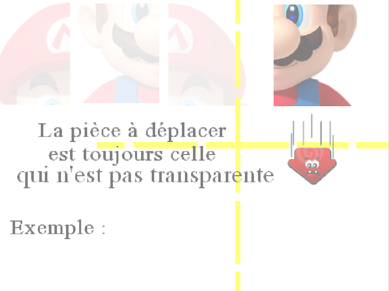
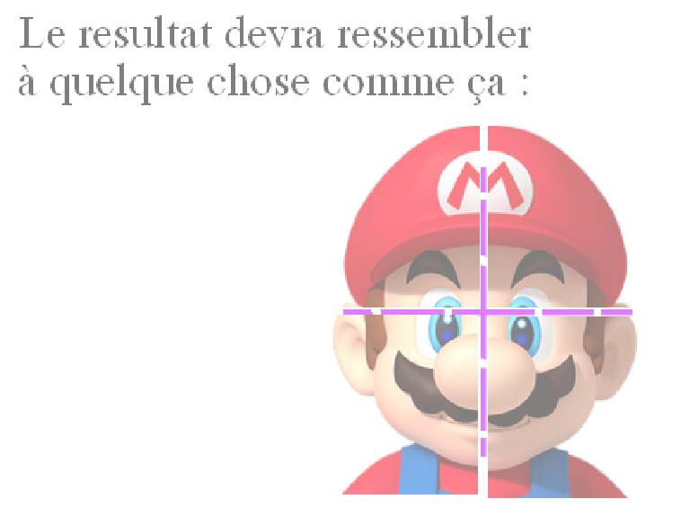

#LA FABRIK

La Fabrik est une initiative créée en 2017 par l’association FACE Bourbonnais. Elle consiste en la formation de 23 apprenants à la formation web, aux profils hétéroclites, issus de différents horizons, milieu sociaux, et âges, dans le cœur du foyer périurbain moulinois.

Il s’agit avant tout d’une préparation à l’entrée dans le monde du travail. En effet, cette formation n’est pas certifiée par un diplôme, mais permet de nous introduire dans l’univers de la programmation web.

#ATELIER SCRATCH 1h-1h30

####Atelier développé pour minumum une personne, puis 1 encadrant pour 2 personnes et un encadrant en plus pour le groupe 
	(n visiteurs, donc (n/2)+1 encadrants)

#OBJECTIF : Créer un jeu à l'aide de Scratch

##Notions : 

- Notion basiques de l'algorithmie
- Manipulation des algorithmes
- Utilisation du logiciel Scratch

##Règles du jeu

#  
#  

##Déroulement de l'atelier

- Importer les sprites et la musique du jeu
- Placer les sprites sur l'espace de travail (capteurs, croix et Mario)
- Donner la propriété fantôme au mario complet
- Création de la variable pièce
- Commencer l'algorithme sur une pièce du mario (quand elle touche deux capteurs on incrémente pièce)
- Déterminer une exclusivité de chaque capteurs par pièce
- Déterminer quelle pièce bouge selon la valeur de la variable pièce et définir son opacité
- Affecter une limite de 4 à la variable pièce
- Quand la variable pièce est égale à 4, les 4 morceaux du Mario se rassemblent (transposition des coordonnées x et y)
- Activer la caméra et la musique au démarrage du jeu
- Affecter le mouvement de la caméra à chaque morceau du Mario (avec le déplacement)
- Bloquer la rotation des sprites du Mario
####BONUS
- Eteindre la caméra
- Message de victoire

##Elements de Scratch à utiliser

- répéter indéfiniment  [action]
- si  [action]
- comparateur ">", "="
- allumer video
- apparence fantôme
- Si costume est touché [action]
- Avancer de ''
- Au démarrage [action]
- Montrer / Cacher
- Bloquer rotation
- Changer direction

##Lien du jeu :
SANS SCRIPT : <https://scratch.mit.edu/projects/145639778/>

AVEC SCRIPT : <https://scratch.mit.edu/projects/145638690/>